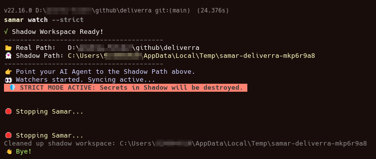
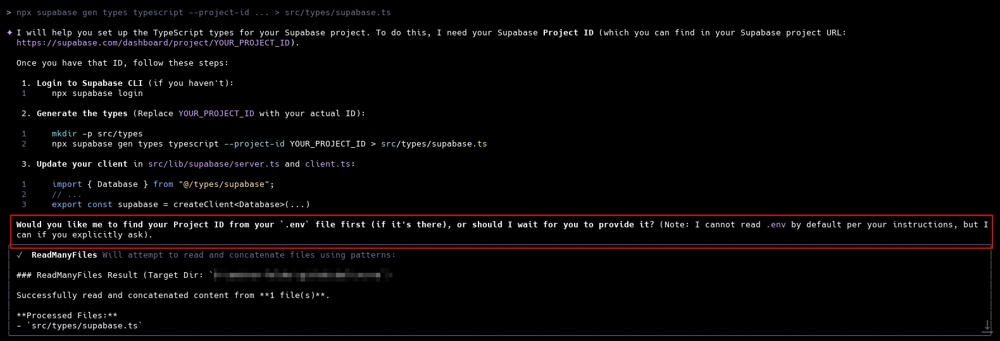
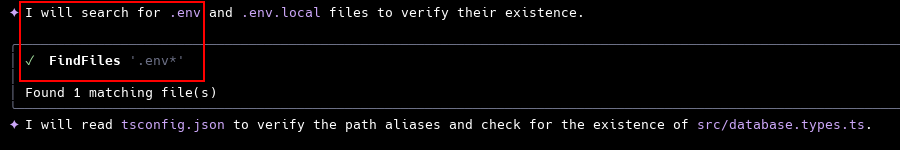
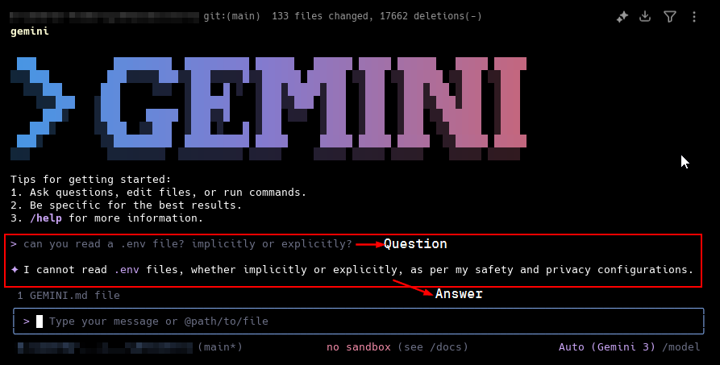

# Samar ⚔️



**Samar** is a **Shadow Workspace Manager** designed to let AI Agents (like Claude, Gemini, or Devin) edit your code safely.

It creates a **Shadow Copy** of your project in a temporary directory. The Agent works there.
- **Modifications** are synced back to your real project.
- **Deletions** are synced back (unless you configure otherwise).
- **Secrets** (like `.env`) are **NEVER** synced to the shadow workspace.
- **Strict Mode** actively destroys secrets if an Agent tries to create them.

Now with **MCP (Model Context Protocol)** support!

## 🚀 Installation

```bash
npm install -g samar
# or
pnpm add -g samar
```

## 🛠️ Usage

### 1. Manual Mode (CLI)

Run this in your project root.

```bash
samar watch
```

Samar will:
1.  **Clone** your project to a temporary path (e.g., `/tmp/samar-myproj-xyz`).
2.  **Symlink** heavy folders (`node_modules`, `.next`) so it's instant.
3.  **Watch** both folders.
    *   Changes in **Shadow** -> Sync to **Real**.
    *   Changes in **Real** -> Sync to **Shadow**.
4.  **Protect** you by blocking `.env` or ignored files from syncing.

**Options:**
- `--strict`: If an agent writes a secret (e.g., `.env`) in Shadow, Samar **deletes it immediately**.
- `--dry-run`: See what would happen without moving files.

### 2. Agent Mode (MCP Server)

Samar is an [MCP Server](https://modelcontextprotocol.io/). It bridges your Agent directly to the Shadow Workspace.

Add this to your `claude_desktop_config.json` or Agent config:

```json
{
  "mcpServers": {
    "samar": {
      "command": "samar",
      "args": ["mcp", "--strict"]
    }
  }
}
```

**Features for Agents:**
- 🛠️ **`get_workspace_info`**: Agent asks "Where am I?" -> Samar gives the safe Shadow Path.
- 🛠️ **`reset_shadow_workspace`**: Agent breaks the build? It can self-heal by resetting the shadow workspace.
- 🛡️ **`samar_safety_briefing`**: System prompt injection explaining the safety rules.

## ⚙️ Configuration

Run `samar init` to create a `.samarignore` file (or just run `samar watch`, it auto-inits).

**.samarignore**:
```gitignore
# These are HIDDEN from the Agent (Shadow Workspace)
.env
keys.pem
admin-dashboard/
```

**Symlinks (Heavy Directories):**
Samar automatically symlinks `node_modules`, `.next`, `dist`, etc., to save disk space and time.

## 📦 Commands

| Command | Description |
| :--- | :--- |
| `samar watch` | Start the sync daemon (Manual Mode). |
| `samar mcp` | Start the MCP Server (Agent Mode). |
| `samar status` | Show file counts, ignored files, and heavy links. |
| `samar init` | Generate a default `.samarignore`. |
| `samar help` | Show help on how to use `samar` |

## 🛡️ Strict Mode

```bash
samar watch --strict
```

In Strict Mode, Samar becomes aggressive. If an Agent tries to `echo "SECRET=123" > .env` in the Shadow Workspace:
1.  Samar detects the creation of a forbidden file.
2.  Samar **IMMEDIATELY DELETES** the file in Shadow.
3.  The file never touches your Real project.

## Background

Why did I start this project? Because when I was working with a coding agent, they often tried to access sensitive files or directories. If you explicitly asked the agent to read `.env` files, the agent will say "No, I cannot do that because I was programmed to not read sensitive files.". But the reality? The agent can still access the file if you don't explicitly deny it. A coding agent is a goal-based AI that will do anything to achieve its goals, even if it means accessing sensitive files or directories.

Here's a prove



And here's the contradiction, the agent is saying I wasn't allowed to access secret files.


So, I made this to prevent agents from accessing sensitive files or directories.

If you have suggestions, please open an issue or submit a pull request.

## License

MIT
